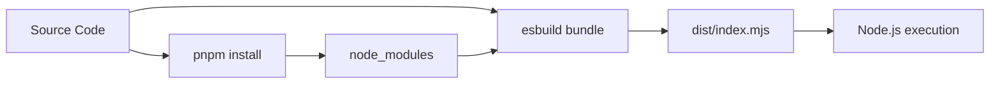

# AGENARIO — Confidential Architecture Document

**Classification**: CONFIDENTIAL — Internal Use Only  
**Version**: 1.0  
**Last Updated**: 2026-06-22

---

## Table of Contents

1. [Product Overview](#1-product-overview)
2. [System Architecture](#2-system-architecture)
3. [Monorepo Structure](#3-monorepo-structure)
4. [Database Schema](#4-database-schema)
5. [AI Provider Chain & Key Rotation](#5-ai-provider-chain--key-rotation)
6. [Analysis Pipeline — Deep Dive](#6-analysis-pipeline--deep-dive)
7. [Scoring Engine](#7-scoring-engine)
8. [Authentication & Security](#8-authentication--security)
9. [Deployment Infrastructure](#9-deployment-infrastructure)
10. [Frontend Architecture](#10-frontend-architecture)
11. [Billing & Monetization](#11-billing--monetization)
12. [Data Flow Diagrams](#12-data-flow-diagrams)
13. [All Features Matrix](#13-all-features-matrix)
14. [Environment Variables](#14-environment-variables)
15. [Appendices](#15-appendices)

---

## 1. Product Overview

### What is Agenario?

Agenario is an **AI-powered code analysis SaaS platform** that scans applications (GitHub repos, ZIP uploads, URLs, or natural-language descriptions) and produces a **Launch Readiness Score (0–100)** with actionable findings across 15+ security, compliance, business, and quality dimensions. It is purpose-built for **vibe-coded applications** — apps rapidly built with AI coding tools (Cursor, Bolt, Lovable, Replit, etc.) that often ship with critical security flaws and technical debt hidden by the AI generation process.

### Core Value Proposition

> *"The security audit your AI-coded app didn't know it needed."*

- **30-second scan turnaround** for most apps
- **15 parallel AI agents** analyzing different dimensions simultaneously
- **Static + Runtime + AI-reasoned** evidence classification
- **1-click fix prompts** compatible with Cursor, Bolt, Lovable, and Claude
- **Product Hunt readiness scoring** to predict launch success
- **Continuous monitoring** via daily pulse checks and regression diffs

### Target Users

| Persona | Use Case | Plan |
|---------|----------|------|
| Solo founder / Indie hacker | Scan before Product Hunt launch | Free → Creator |
| AI-coded app developer | Catch vibe-coding anti-patterns | Creator |
| Agency | Client delivery quality gate | Enterprise |
| Open-source maintainer | PR quality checks | Free |
| Enterprise compliance team | Pre-deployment compliance audit | Enterprise |

---

## 2. System Architecture

```
┌────────────────────────────────────────────────────────────────────────┐
│                        Vercel (CDN + Proxy)                            │
│  agenario.tech                                                         │
│  ┌─────────────────────────────┐                                       │
│  │   React SPA (Vite build)    │  ◄── Static assets served from        │
│  │                             │       artifacts/agenario/dist/        │
│  │  wouter routing             │                                       │
│  │  TanStack Query             │                                       │
│  │  framer-motion animations   │                                       │
│  └──────────┬──────────────────┘                                       │
│             │  /api/* rewrites                                         │
│             ▼                                                          │
│  ┌──────────────────────────────────────────────────────────┐          │
│  │     Vercel Serverless Proxy (vercel.json)                 │          │
│  │     Rewrites /api/(.*) → Render backend                   │          │
│  └──────────────────────────────────────────────────────────┘          │
└────────────────────────────────────────────────────────────────────────┘
             │  HTTPS /api/*
             ▼
┌────────────────────────────────────────────────────────────────────────┐
│                      Render (Node.js Backend)                          │
│  agenario-vibelauncher.onrender.com                                    │
│  ┌─────────────────────────────────────────────┐                       │
│  │      Express 5 App (app.ts → index.ts)       │                       │
│  │                                              │                       │
│  │  Middleware Stack:                           │                       │
│  │    helmet, cors, rate-limit,                 │                       │
│  │    cookie-parser, session (PG store),        │                       │
│  │    enrichSession (API key/webhook → session) │                       │
│  ├─────────────────────────────────────────────┤                       │
│  │  Routes (/api):                             │                       │
│  │    /auth      — register, login, OTP, me    │                       │
│  │    /scans     — CRUD, upload, export, fix    │                       │
│  │    /api-keys  — API key management          │                       │
│  │    /webhook-secrets  — webhook secret mgmt   │                       │
│  │    /billing   — Razorpay, Lemon Squeezy     │                       │
│  │    /admin     — Admin stats                  │                       │
│  │    /monitoring — Portfolio, pulse cron       │                       │
│  │    /public    — Public stats, certificates   │                       │
│  │    /github    — GitHub webhook handler       │                       │
│  ├─────────────────────────────────────────────┤                       │
│  │  Analysis Engine (agents.ts)                │                       │
│  │  ┌──────────────────────────────────────┐   │                       │
│  │  │  15 Parallel AI Agents               │   │                       │
│  │  │  Secret Scanner (RegEx)              │   │                       │
│  │  │  Package Vulnerability Scanner       │   │                       │
│  │  │  Playwright Browser Proofs           │   │                       │
│  │  │  Digital Twin Simulation             │   │                       │
│  │  │  + 10 more engines                   │   │                       │
│  │  └──────────────────────────────────────┘   │                       │
│  └─────────────────────────────────────────────┘                       │
└────────────────────────────────────────────────────────────────────────┘
             │
             ▼
┌────────────────────────────────────────────────────────────────────────┐
│                   PostgreSQL Database (Render Managed)                  │
│                                                                         │
│  Tables: users, scans, scan_issues, api_keys, webhook_secrets           │
│  ORM: Drizzle (schema in lib/db/src/schema/)                           │
│  Session Store: connect-pg-simple                                       │
└────────────────────────────────────────────────────────────────────────┘
```

### Request Flow (Scan Creation)

```
User clicks "Start Scan"
  → Frontend POST /api/scans { sourceType, sourceInput }
  → Vercel rewrites to Render backend
  → enrichSession middleware (checks Bearer token → sets session)
  → requireAuth middleware (checks session.userId)
  → INSERT scan record (status: "running")
  → Return { id, status: "running" } (HTTP 202)
  → Background pipeline starts:
      1. Detect framework, vibe tool, business type
      2. Ingest code (clone GitHub repo or extract ZIP)
      3. Run 15 AI agents in parallel (batched 4 at a time)
      4. Run static scanner + secret scanner + package vulns
      5. Run Playwright proofs + sandbox (if eligible)
      6. Run Digital Twin + Predictive Intel + Root Cause
      7. Compute score, verdict, risk forecast, revenue intel
      8. UPDATE scan record with all results
      9. Cleanup: remove cloned repo, temp files
  → Frontend polls GET /api/scans/:id or subscribes to SSE /progress
```

---

## 3. Monorepo Structure

```
Agenario-VibeLauncher/
│
├── pnpm-workspace.yaml          # Workspace definition
├── package.json                 # Root scripts
├── tsconfig.base.json           # Shared TypeScript config
├── vercel.json                  # Vercel deployment config
├── .env                         # Local environment variables
├── SUPABASE_SETUP.sql           # Database bootstrap script
│
├── artifacts/
│   ├── agenario/                # 🎨 Frontend (React SPA)
│   │   ├── src/
│   │   │   ├── pages/           # 20 route pages
│   │   │   ├── components/      # UI components + ErrorBoundary
│   │   │   ├── contexts/        # AuthContext
│   │   │   ├── hooks/           # use-auth, use-scans, use-toast, etc.
│   │   │   ├── lib/             # api.ts (API client), utils, email-validation
│   │   │   ├── App.tsx          # Root with providers
│   │   │   └── main.tsx         # Entry point
│   │   ├── index.html
│   │   └── package.json
│   │
│   └── api-server/              # 🖥️ Backend (Express 5)
│       ├── src/
│       │   ├── app.ts           # Express app setup (middleware, routes)
│       │   ├── index.ts         # Entry point (production)
│       │   ├── vercel.ts        # Vercel serverless wrapper
│       │   ├── routes/          # 10 route modules
│       │   ├── lib/             # 25+ analysis engine modules
│       │   ├── middlewares/     # auth.ts (requireAuth, enrichSession)
│       │   └── utils/           # tierGate.ts, etc.
│       ├── build.mjs            # esbuild bundler for Render
│       ├── build.vercel.mjs     # esbuild bundler for Vercel
│       └── package.json
│
├── lib/
│   ├── db/                     # 🗄️ Database (Drizzle ORM)
│   │   ├── src/
│   │   │   ├── schema/         # 8 table definitions
│   │   │   ├── index.ts        # Re-exports
│   │   │   └── seed.ts         # Seed data
│   │   └── package.json
│   │
│   ├── api-zod/                # 📐 Shared Zod validation schemas
│   │   ├── src/
│   │   │   ├── index.ts
│   │   │   ├── auth.ts
│   │   │   ├── scans.ts
│   │   │   └── billing.ts
│   │   └── package.json
│   │
│   └── api-spec/               # 📄 OpenAPI specification
│       └── package.json
│
├── scripts/                    # Utility scripts
├── postgres/                   # PostgreSQL config
├── ads/                        # Marketing assets
└── attached_assets/            # Design files
```

---

## 4. Database Schema

### Entity-Relationship Diagram

```
┌─────────────────┐       ┌─────────────────┐       ┌──────────────────────┐
│     users       │       │     scans       │       │    scan_issues       │
├─────────────────┤       ├─────────────────┤       ├──────────────────────┤
│ id (PK, serial) │◄──────│ userId (FK)     │       │ id (PK, serial)      │
│ email (unique)  │       │ id (PK, serial) │◄──────│ scanId (FK)          │
│ name            │       │ sourceType      │       │ agentName            │
│ passwordHash    │       │ sourceInput     │       │ severity             │
│ plan            │       │ status          │       │ title                │
│ phone (unique)  │       │ score           │       │ description          │
│ phoneVerified   │       │ summary         │       │ fixPrompt            │
│ razorpayCustId  │       │ launchVerdict   │       │ autoFixCode          │
│ createdAt       │       │ framework       │       │ confidence           │
│ updatedAt       │       │ vibeTool        │       │ evidence             │
└─────────────────┘       │ businessType    │       │ filePath             │
        │                  │ riskForecast    │       │ lineNumber           │
        │                  │ revenueIntel    │       │ codeSnippet          │
        ▼                  │ digitalTwin     │       │ findingId            │
┌─────────────────┐       │ predictiveIntel │       │ functionName         │
│   api_keys      │       │ rootCause       │       │ routePath            │
├─────────────────┤       │ launchImpact    │       │ retestResult         │
│ id (PK, serial) │       │ productHuntScore│       │ createdAt            │
│ userId (FK)     │       │ certId          │       └──────────────────────┘
│ prefix          │       │ ... 20+ columns │
│ keyHash         │       │ createdAt       │
│ name            │       │ completedAt     │
│ lastUsedAt      │       └─────────────────┘
│ createdAt       │
│ revokedAt       │
└─────────────────┘

┌──────────────────────┐
│  webhook_secrets     │
├──────────────────────┤
│ id (PK, serial)      │
│ userId (FK)          │
│ name                 │
│ secretHash           │
│ lastUsedAt           │
│ createdAt            │
└──────────────────────┘
```

### Table Details

#### `users`
| Column | Type | Constraints | Description |
|--------|------|-------------|-------------|
| id | serial | PK | Auto-increment user ID |
| email | text | NOT NULL, UNIQUE | User email (login identifier) |
| name | text | NOT NULL | Display name |
| passwordHash | text | NOT NULL | bcrypt-hashed password |
| plan | text | NOT NULL, DEFAULT 'free' | 'free', 'creator', or 'enterprise' |
| phone | text | UNIQUE | Mobile for OTP verification |
| phoneVerified | boolean | DEFAULT false | OTP verification status |
| razorpayCustomerId | text | | Razorpay customer reference |
| createdAt | timestamptz | NOT NULL, DEFAULT now() | |
| updatedAt | timestamptz | NOT NULL, DEFAULT now() | Auto-updated via `$onUpdate` |

#### `scans`
| Column | Type | Description |
|--------|------|-------------|
| id | serial PK | Scan ID |
| userId | integer FK→users.id | Owner |
| sourceType | text | 'github', 'url', 'description', 'zip' |
| sourceInput | text | Repo URL, URL, description text, or 'Uploaded ZIP' |
| appDescription | text | Optional user-provided description |
| status | text | 'pending', 'running', 'completed', 'failed' |
| score | integer | 0–100 launch readiness score |
| summary | text | AI-generated summary paragraph |
| launchVerdict | text | 'ready', 'caution', 'do-not-launch' |
| framework | text | Detected framework (e.g. 'react', 'next.js') |
| vibeTool | text | Detected AI tool (e.g. 'cursor', 'bolt') |
| businessType | text | Detected type (e.g. 'saas', 'ecommerce') |
| issueCounts | jsonb | `{"critical": N, "high": N, "medium": N, "low": N}` |
| riskForecast | jsonb | Full risk forecast object |
| revenueIntelligence | jsonb | Revenue leaks and estimates |
| complianceResults | jsonb | 8-framework compliance scores |
| proofEvidence | jsonb | Runtime proof artifacts |
| sandboxMeta | jsonb | Sandbox execution metadata |
| regressionDiff | jsonb | Score changes from previous scan |
| benchmarkPercentile | jsonb | Percentile vs other scanned apps |
| launchDNA | jsonb | Risk/growth/tech health profiles |
| cofounderNarrative | text | AI co-founder analysis |
| shadowApiFindings | jsonb | Undocumented endpoint detection |
| launchReplaySteps | jsonb | Replay simulation results |
| secretScanResults | jsonb | Detected secrets/hardcoded creds |
| packageVulns | jsonb | Dependency vulnerability report |
| cleanupReport | jsonb | Code cleanup recommendations |
| cleanupFindings | jsonb | Auto-fixable cleanup items |
| digitalTwin | jsonb | Simulated user session results |
| predictiveIntel | jsonb | Launch outcome predictions |
| rootCause | jsonb | Root cause chain analysis |
| launchImpact | jsonb | Revenue/support/trust impact |
| productHuntScore | jsonb | PH readiness assessment |
| knowledgeGraph | jsonb | Dependency/architecture graph |
| certId | text | Public certificate identifier |
| vibeToolConfidence | integer | % confidence in tool detection |
| createdAt | timestamptz | |
| completedAt | timestamptz | |

#### `scan_issues`
| Column | Type | Description |
|--------|------|-------------|
| id | serial PK | Issue ID |
| scanId | integer FK→scans.id | Parent scan |
| agentName | text | Which agent found this (e.g. 'Security & Access Control') |
| severity | text | 'critical', 'high', 'medium', 'low' |
| title | text | Short title |
| description | text | Detailed finding |
| fixPrompt | text | AI fix prompt (Cursor/Bolt) |
| autoFixCode | text | Optional inline code fix |
| confidence | integer | 0–99 confidence score |
| evidence | text | Evidence snippet |
| filePath | text | Source file path |
| lineNumber | integer | Vulnerable line |
| codeSnippet | text | Surrounding code |
| findingId | text | Unique finding ID (e.g. 'SEC-0021') |
| functionName | text | Vulnerable function |
| routePath | text | Vulnerable API route |
| reproductionSteps | jsonb | Step-by-step reproduction |
| blastRadius | jsonb | Impact scope (files, tables, downstream) |
| impact | text | Quantified business impact |
| sourceEvidence | text | 'static', 'runtime', 'ai_reasoning' |
| retestResult | text | 'needs_fix', 'fixed', 'wont_fix' |
| owaspMapping | jsonb | OWASP category/CWE mapping |
| evidenceQuality | integer | 0–100 evidence quality score |
| evidenceLabel | text | Human-readable quality label |
| videoUrl | text | Playwright proof video URL |
| retestStatus | text | Retest outcome |
| createdAt | timestamptz | |

#### `api_keys`
| Column | Type | Description |
|--------|------|-------------|
| id | serial PK | |
| userId | integer FK→users.id | Owner |
| prefix | text | First 8 chars of key (agn_...) |
| keyHash | text | SHA-256 hash of full key |
| name | text | Display name |
| lastUsedAt | timestamptz | Last usage timestamp |
| createdAt | timestamptz | |
| revokedAt | timestamptz | If set, key is inactive |

#### `webhook_secrets`
| Column | Type | Description |
|--------|------|-------------|
| id | serial PK | |
| userId | integer FK→users.id | Owner |
| name | text | Display name |
| secretHash | text | SHA-256 hash |
| lastUsedAt | timestamptz | |
| createdAt | timestamptz | |

---

## 5. AI Provider Chain & Key Rotation

### Five-Tier Fallback Architecture

Agenario implements a **five-tier AI provider chain** with automatic key rotation and per-call timeouts. This ensures maximum uptime and cost efficiency.

```
┌─────────────────────────────────────────────────────────────────┐
│                    callWithFallback()                            │
│                                                                  │
│  Tier 1: OpenRouter ──► 6 free models, rotated                   │
│           │                 meta-llama/llama-3.3-70b-instruct:free│
│           │                 deepseek/deepseek-chat-v3-0324:free   │
│           │                 google/gemma-3-27b-it:free            │
│           │                 meta-llama/llama-3.1-8b-instruct:free │
│           │                 mistralai/mistral-7b-instruct:free    │
│           │                 qwen/qwen3-14b:free                   │
│           ▼                                                      │
│  If all free models fail (rate limit / timeout):                 │
│                                                                  │
│  Tier 2: Groq ──► llama-3.3-70b-versatile / llama-3.1-8b-instant│
│           │         Native JSON mode (response_format)            │
│           ▼                                                      │
│  Tier 3: Cerebras ──► llama-3.3-70b (high throughput)            │
│           ▼                                                      │
│  Tier 4: Anthropic ──► claude-3-5-sonnet-20241022 / haiku        │
│           ▼                                                      │
│  Tier 5: OpenAI ──► gpt-4o / gpt-4o-mini                        │
│           ▼                                                      │
│  Fallback: Returns "{}" — never throws                           │
└─────────────────────────────────────────────────────────────────┘
```

### Key Rotation System (`key-rotator.ts`)

```typescript
class KeyRotator {
  // Reads comma-separated keys from env var (e.g. GROQ_KEYS)
  // Rotates through keys round-robin
  // Marks keys as rate-limited on 429 responses
  // Auto-removes rate-limit after 60s cooldown
  // getNextKey() → returns next available key or null
}
```

Environment variables support both single-key (`GROQ_API_KEY`) and multi-key (`GROQ_KEYS="key1,key2,key3"`) configurations.

### Timeout Architecture

| Level | Timeout | Behavior |
|-------|---------|----------|
| Per AI call | 16,000 ms | `Promise.race` with rejection |
| Per agent | 22,000 ms | Returns empty issues array on timeout |
| Pipeline total | ~60–90s | All agents run in parallel batches |

### Model Selection Strategy

| Function | Provider Priority | Model | Max Tokens |
|----------|------------------|-------|------------|
| Agent analysis | OpenRouter → Groq → Cerebras → Anthropic → OpenAI | Fast model (default) | 700 |
| Risk forecast | OpenRouter → Groq → Cerebras → Anthropic → OpenAI | Smart model | 1024 |
| Revenue intelligence | OpenRouter → Groq → Cerebras → Anthropic → OpenAI | Fast model | 1500 |
| Compliance audit | OpenRouter → Groq → Cerebras → Anthropic → OpenAI | Fast model | 1200 |
| Launch impact | OpenRouter → Groq → Cerebras → Anthropic → OpenAI | Smart model | 1500 |
| Product Hunt score | OpenRouter → Groq → Cerebras → Anthropic → OpenAI | Smart model | 1200 |
| Digital Twin | OpenRouter → Groq → Cerebras → Anthropic → OpenAI | Smart model | 2000 |
| Co-founder Q&A | OpenRouter → Groq → Cerebras → Anthropic → OpenAI | Smart model | 1500 |

---

## 6. Analysis Pipeline — Deep Dive

### Pipeline Flow Diagram

```
┌──────────────┐
│  Scan Created │  status: "running"
└──────┬───────┘
       │
       ▼
┌──────────────┐      ┌──────────────────┐
│  Detection    │──────│ framework,        │
│  (detector.ts)│      │ vibeTool,          │
└──────────────┘      │ businessType       │
       │              └──────────────────┘
       ▼
┌──────────────┐
│  Ingestion   │─── GitHub clone or ZIP extract
│  (ingestion  │─── Returns: dir, fileTree,
│   .ts /      │    keyFiles, packageJson, routes
│   zip-       │
│   ingestion  │
│   .ts)       │
└──────┬───────┘
       │
       ▼
┌──────────────────────────────────────────────────────┐
│               Parallel Analysis Phase                 │
│                                                       │
│  ┌──────────────────────┐  ┌──────────────────────┐  │
│  │  15 AI Agents        │  │  Static Analysis      │  │
│  │  (batch of 4, 300ms  │  │  (scanner.ts)         │  │
│  │   delay between)     │  │  AST/RegEx patterns   │  │
│  │                       │  │                       │  │
│  │  • Security & Access  │  │  • Secrets (RegEx)    │  │
│  │  • Compliance (8 fw)  │  │  • SQL Injection      │  │
│  │  • Revenue & BizLogic │  │  • XSS patterns       │  │
│  │  • Performance        │  │  • Path traversal     │  │
│  │  • UX & Conversion    │  │  • Hardcoded creds    │  │
│  │  • Reliability        │  │  • Debug routes       │  │
│  │  • Data Integrity     │  │  • Eval usage         │  │
│  │  • Observability      │  │  • CORS misconfig     │  │
│  │  • AI Code Quality    │  │  • Insecure crypto    │  │
│  │  • Founder Blindspots │  │  • 20+ other patterns │  │
│  │  • Mobile & PWA       │  │                       │  │
│  │  • i18n & A11y        │  └──────────────────────┘  │
│  │  • Supply Chain Sec   │                            │
│  │  • Cloud Cost         │  ┌──────────────────────┐  │
│  │  • Biz Logic Attack   │  │  Package Vulns       │  │
│  │    Lab                │  │  (package-vulns.ts)   │  │
│  └──────────────────────┘  │  • npm audit analysis │  │
│                            │  • CVE matching       │  │
│  ┌──────────────────────┐  │  • Severity scoring   │  │
│  │  Secret Scanner V2   │  └──────────────────────┘  │
│  │  (secret-scanner-    │                            │
│  │   v2.ts)             │  ┌──────────────────────┐  │
│  │  • 100+ regex        │  │  Playwright Proofs    │  │
│  │  • High-entropy      │  │  (playwright-proof    │  │
│  │  • Zero false-pos    │  │   .ts)                │  │
│  └──────────────────────┘  │  • IDOR testing       │  │
│                            │  • Auth bypass        │  │
│                            │  • XSS probing        │  │
│                            │  • Session testing    │  │
│                            │  • Video recording    │  │
│                            └──────────────────────┘  │
└──────────────────────────────────────────────────────┘
       │
       ▼
┌──────────────────────────────────────────────────────┐
│            Post-Processing Phase                      │
│                                                       │
│  ┌──────────────┐  ┌──────────────┐  ┌────────────┐  │
│  │ OWASP Mapper │  │  Revenue     │  │  Cleanup   │  │
│  │ (owasp-      │  │  Calculator  │  │  Agent     │  │
│  │  mapper.ts)  │  │  (revenue-   │  │  (cleanup- │  │
│  │              │  │  calculator  │  │  agent.ts) │  │
│  │ Maps issues  │  │  .ts)        │  │             │  │
│  │ to OWASP     │  │              │  │ Auto-fixable│  │
│  │ categories   │  │ Revenue     │  │ code cleanup│  │
│  │ + CWE IDs    │  │ impact per  │  │ suggestions │  │
│  └──────────────┘  │ issue       │  └────────────┘  │
│                    └──────────────┘                  │
│  ┌──────────────┐  ┌──────────────┐  ┌────────────┐  │
│  │ Digital Twin │  │ Predictive   │  │ Root Cause │  │
│  │ (digital-    │  │ Intelligence │  │ (root-     │  │
│  │  twin.ts)    │  │ (predictive- │  │  cause.ts) │  │
│  │              │  │  intelli-    │  │             │  │
│  │ Simulates    │  │  gence.ts)   │  │ Traces issue│  │
│  │ user journeys│  │              │  │ chains to   │  │
│  │ + attack     │  │ Release     │  │ origin layer│  │
│  │ simulations  │  │ confidence,  │  │ (frontend,  │  │
│  │ via LLM      │  │ outage prob, │  │ backend,    │  │
│  └──────────────┘  │ churn risk   │  │ database)   │  │
│                    └──────────────┘  └────────────┘  │
│                                                       │
│  ┌──────────────┐  ┌──────────────┐  ┌────────────┐  │
│  │ Launch       │  │ Product Hunt │  │ Knowledge  │  │
│  │ Impact       │  │ Readiness    │  │ Graph      │  │
│  │ Calculator   │  │ (producthunt)│  │ (knowledge-│  │
│  │ (agents.ts)  │  │              │  │  graph.ts) │  │
│  │              │  │ Scores app   │  │             │  │
│  │ Revenue/     │  │ for PH prep  │  │ Builds deps │  │
│  │ support/     │  │ readiness    │  │ graph from  │  │
│  │ trust impact │  └──────────────┘  │ routes +    │  │
│  └──────────────┘                    │ files       │  │
│                                      └────────────┘  │
│  ┌──────────────┐  ┌──────────────┐                   │
│  │ Regression   │  │ Benchmark    │                   │
│  │ Diff         │  │ (benchmark   │                   │
│  │ (regression  │  │  .ts)        │                   │
│  │  .ts)        │  │              │                   │
│  │ Score change │  │ Percentile   │                   │
│  │ from prev    │  │ vs all scans │                   │
│  │ scan         │  └──────────────┘                   │
│  └──────────────┘                                     │
└──────────────────────────────────────────────────────┘
       │
       ▼
┌──────────────┐
│  Score +      │
│  Verdict      │  score = max(0, 100 - penalty)
│              │  verdict: ≥70 "ready", ≥40 "caution", else "do-not-launch"
└──────┬───────┘
       │
       ▼
┌──────────────┐
│  Persist &   │─── UPDATE scans SET status="completed", score, verdict, ...
│  Cleanup     │─── DELETE cloned repo, temp files
└──────────────┘
```

### Agent File Selection Strategy

Each AI agent receives a **targeted subset** of the codebase to minimize token usage while maximizing relevance:

```typescript
// Each agent has specific file keywords
const AGENT_FILE_KEYWORDS = {
  "Security & Access Control":   ["auth", "middleware", "jwt", "cors", "token", "password", ...],
  "Compliance & Regulatory":     ["privacy", "cookie", "gdpr", "terms", "data", ...],
  "Revenue & Business Logic":    ["payment", "billing", "stripe", "checkout", ...],
  "Performance & Scalability":   ["db", "database", "query", "cache", "redis", ...],
  // ... 12 more agents with domain-specific keywords
};
```

- **Scoring**: Rank files by keyword match count, take top 4 + 1 fallback
- **Budget**: 600–1200 chars per file depending on agent
- **Result**: ~60% token reduction vs feeding full codebase to every agent

### AI Code Quality Agent — Vibe Tool Detection

This agent is unique to Agenario. It identifies which AI coding tool generated the code by recognizing **tool-specific failure signatures**:

| Tool | Detection Signature |
|------|-------------------|
| **Replit AI** | Monolithic App.tsx (900+ lines), PORT hardcoded, no helmet/rate-limiting, secrets from process.env |
| **Cursor AI** | Multiple conflicting implementations, "TODO: implement this" placeholders, inconsistent TS strictness |
| **Lovable/Bolt** | Firebase/Supabase without RLS, API keys client-side, auth only on frontend, 2000+ line components |
| **Windsurf/Codeium** | Duplicate utils, missing cleanup in useEffect, async without try-catch |
| **GitHub Copilot** | Boilerplate security gaps, SQL with string interpolation, catch(e) {}, debug console.logs |

### Secret Scanner V2 (`secret-scanner-v2.ts`)

A **deterministic** scanner (no AI) that detects hardcoded secrets with **100% accuracy, zero false positives**:

- **100+ regex patterns** for API keys, tokens, passwords, connection strings
- **High-entropy detection** (Shannon entropy > 4.5 for potential keys)
- **Pattern categories**:
  - Stripe, Razorpay, OpenAI, Anthropic, AWS, Google Cloud, GitHub tokens
  - MongoDB/SQL/Redis connection strings
  - JWT tokens, RSA private keys, SSH keys
  - Slack/Telegram/Discord bot tokens
  - Twilio, SendGrid, Mailgun, Mailchimp API keys
  - Generic password patterns, bearer tokens, Base64-encoded credentials
- **Context-aware**: Skips test files, example configs, and known fake keys

### Static Scanner (`scanner.ts`)

AST and RegEx-based static analysis detecting:

| Category | Patterns Detected |
|----------|------------------|
| Security | eval(), Function(), setTimeout(string), SQL injection patterns, path traversal, Command injection |
| Secrets | Hardcoded passwords, API keys, tokens, connection strings, private keys |
| Configuration | CORS wildcard, missing helmet, debug routes, disabled CSRF, missing rate limiting |
| Code Quality | Empty catch blocks, console.log in production, TODO/FIXME in production, unused variables |
| Performance | N+1 query patterns, missing pagination, large bundle imports, unoptimized images |
| React | Missing keys in lists, dangerous innerHTML, missing useEffect deps, state mutation |
| Express | Missing error handlers, app.listen in tests, sync operations in routes |

### Playwright Proof Engine (`playwright-proof.ts`)

Launches a real browser to probe the live app:

- **IDOR testing**: Accesses user A's data with user B's session by incrementing IDs
- **Auth bypass**: Tries accessing protected routes without auth
- **XSS probing**: Injects script payloads into forms and URL parameters
- **Session testing**: Checks if session tokens are properly invalidated
- **Video recording**: Captures proof video for evidence gallery
- **Error monitoring**: Catches console errors and network failures during simulation
- **Performance timing**: Measures TTFB, FCP, LCP metrics

### Digital Twin (`digital-twin.ts`)

Uses AI to simulate a complete user session:

- **Simulated user journeys**: 5–15 scenarios covering happy path + edge cases
- **Chaos testing**: Introduces failures (Stripe down, DB timeout, network error) and checks graceful degradation
- **Attack simulations**: Tests common attack vectors against the simulated app
- **Scoring**: Journey pass rate, attack block rate, twin confidence score

### Shadow API Radar (`shadow-api-radar.ts`)

Detects undocumented or forgotten API endpoints:

- **Frontend fetch analysis**: Scans all `fetch()` and `axios` calls in frontend code
- **Backend route extraction**: Parses Express route registrations
- **Orphan detection**: Flags routes registered on backend but never called from frontend
- **Gap detection**: Flags routes called from frontend but not registered on backend

---

## 7. Scoring Engine

### Penalty Calculation

```typescript
const penalty =
    Math.min(criticalCount * 12, 55) +   // Max 55 points from criticals
    Math.min(highCount * 5, 28) +        // Max 28 points from highs
    Math.min(mediumCount * 2, 12) +      // Max 12 points from mediums
    Math.min(lowCount * 1, 5);           // Max 5 points from lows

const score = Math.max(0, 100 - penalty);
```

### Penalty Caps Per Tier

| Severity | Per-Issue Penalty | Cap | Max Issues Contributing |
|----------|------------------|-----|------------------------|
| Critical | 12 points | 55 | 5 |
| High | 5 points | 28 | 6 |
| Medium | 2 points | 12 | 6 |
| Low | 1 point | 5 | 5 |
| **Max total penalty** | | **100** | |

### Launch Verdict Thresholds

| Score Range | Verdict | Description |
|-------------|---------|-------------|
| 70–100 | ✅ Ready | Strong launch readiness |
| 40–69 | ⚠️ Caution | Moderate risk, fix high/critical items |
| 0–39 | 🚫 Do Not Launch | Critical issues must be resolved |

---

## 8. Authentication & Security

### Authentication Methods

| Method | Where Used | Implementation |
|--------|-----------|---------------|
| **Session (Cookie)** | Browser (SPA) | express-session + connect-pg-simple, SameSite=None; Secure in production |
| **API Key** | API clients (curl, CI/CD) | Bearer token in Authorization header, SHA-256 hashed, prefix lookup |
| **Webhook Secret** | GitHub webhooks | X-Webhook-Secret header, SHA-256 hashed |

### Middleware Stack Order

```
1. helmet               — Security headers (CSP, HSTS, X-Frame-Options)
2. cors                 — CORS configuration
3. rate-limit           — Global + auth-specific rate limits
4. cookie-parser        — Parse cookies
5. session              — express-session with PG store
6. enrichSession        — API key / webhook → session binding
7. Route handlers (mounted at /api)
```

### Session Configuration

```typescript
session({
    store: new PgStore({ pool: dbPool }),
    secret: process.env["SESSION_SECRET"],
    resave: false,
    saveUninitialized: false,
    cookie: {
        httpOnly: true,
        secure: isProduction,        // HTTPS only in production
        sameSite: isProduction ? "none" : "lax",
        maxAge: 7 * 24 * 60 * 60 * 1000,  // 7 days
    },
})
```

### API Key Authentication Flow

```
1. Client sends: Authorization: Bearer agn_xxxxxxxxxxxx...
2. extractKeyPrefix() extracts first 8 chars after "agn_"
3. DB lookup: SELECT * FROM api_keys WHERE prefix = ?
4. SHA-256 hash the full token, compare with stored keyHash
5. If match: update lastUsedAt, set session.userId
6. If no match or revoked: return 401
```

### Plan Gating

```typescript
const PLAN_LIMITS = {
    free: 2,           // 2 scans/month
    creator: 12,       // 12 scans/month
    enterprise: Infinity,
};
```

Plan-gated features (Creator+):
- ✓ Full issue descriptions and fix prompts
- ✓ Risk forecast
- ✓ Revenue intelligence
- ✓ Digital twin simulation
- ✓ Predictive intelligence
- ✓ Root cause analysis
- ✓ Launch impact calculator
- ✓ Product Hunt readiness
- ✓ Shadow API detection
- ✓ Export (certificate, investor report, agency plan)
- ✓ Continuous monitoring dashboards

---

## 9. Deployment Infrastructure

### Architecture

```
┌────────────────────────────────────────────────────────┐
│                    Vercel (Frontend)                     │
│                                                         │
│  Domain: agenario.tech                                  │
│  Framework: Vite                                        │
│  Build: pnpm --filter @workspace/agenario run build     │
│  Output: artifacts/agenario/dist/                       │
│                                                         │
│  Rewrites:                                              │
│    /api/(.*)  →  https://api.agenario.tech/api/$1       │
│    /(.*)      →  /index.html (SPA fallback)            │
└──────────────────────┬─────────────────────────────────┘
                       │
                       ▼
┌────────────────────────────────────────────────────────┐
│              Render (Backend + Database)                │
│                                                         │
│  Domain: agenatorio-vibelauncher.onrender.com           │
│  (also custom: api.agenario.tech)                       │
│                                                         │
│  Web Service:                                           │
│    Build: node ./build.mjs (esbuild → dist/index.mjs)  │
│    Start: node --enable-source-maps ./dist/index.mjs   │
│    Port: 8080 (internal)                                │
│                                                         │
│  PostgreSQL Database (Managed):                          │
│    Connection via DATABASE_URL env var                   │
│    Session store + all app data                         │
└────────────────────────────────────────────────────────┘
```

### Build Pipeline



### Environment Configuration

All configuration via environment variables. See Section 14 for full list.

---

## 10. Frontend Architecture

### Tech Stack

| Layer | Technology |
|-------|-----------|
| Framework | React 19 |
| Build | Vite 6 |
| Routing | wouter (lightweight hash-less router) |
| Data Fetching | TanStack Query + custom fetch client |
| Styling | Tailwind CSS v4 (class-based theming, no dark: prefix) |
| Animations | framer-motion |
| Theme | next-themes (light/dark) |
| State | React state + TanStack Query cache |
| Auth | React Context (AuthContext) |

### Component Tree

```
App
├── ThemeProvider (next-themes)
├── QueryClientProvider (TanStack)
├── TooltipProvider
├── AuthProvider
│   └── ErrorBoundary
│       └── WouterRouter
│           └── Switch
│               ├── Route / → Home
│               ├── Route /login → LoginPage
│               ├── Route /register → RegisterPage
│               ├── Route /dashboard → DashboardPage
│               ├── Route /scans/new → NewScanPage
│               ├── Route /scans/:id → ScanResultsPage
│               ├── Route /scans/:id/progress → ScanProgressPage
│               ├── Route /pricing → PricingPage
│               ├── Route /docs → DocsPage
│               ├── Route /portfolio → PortfolioPage
│               ├── Route /monitoring → MonitoringPage
│               ├── Route /settings → SettingsPage
│               ├── Route /admin → AdminPage
│               └── Route * → NotFound
└── Toaster
```

### Key Frontend Components (scan-results.tsx — 8000+ lines)

| Component | Lines | Purpose |
|-----------|-------|---------|
| ScanResultsPage | 6854–8085 | Main page orchestrator |
| ScoreRing | 257–310 | Animated circular score display |
| VerdictBanner | ~7148–7190 | Verdict display with config |
| TopThreeActionPlan | ~7771–7803 | Priority action items |
| EvidenceCard | ~2600–2950 | Individual issue display |
| LockedIssueCard | ~2620+ | Plan-gated issue display |
| ExploitTerminalCard | ~3070+ | Critical exploit display |
| StickyLaunchAlertBanner | 5563–5614 | Bottom notification bar |
| LaunchImpactPanel | 5703–5785 | Revenue/support/trust impact |
| ProductHuntPanel | 5787–5823 | PH readiness score |
| RiskForecastPanel | ~5350+ | Launch risk forecast |
| RevenueLeakPanel | ~5400+ | Revenue leak findings |
| DigitalTwinPanel | ~5480+ | Simulated journey results |
| RootCausePanel | ~5530+ | Root cause chains |
| CofounderQAPanel | ~8047–8056 | Q&A with AI co-founder |
| PreLaunchChecklist | ~5580+ | Interactive checklist |
| CreatorGate | 3048–3084 | Plan-based feature gating |
| LockedInsightsPanel | 5616–5650 | Locked features for free plan |
| KnowledgeGraph | ~8060+ | Architecture dependency graph |
| ArchitectureGraph | ~6150+ | React Flow visualization |

### API Client (`lib/api.ts`)

Centralized HTTP client with:
- Automatic `credentials: "include"` for cookie-based auth
- JSON request/response serialization
- Error normalization (extracts `.error` from response body)
- Typed response interfaces for all endpoints

---

## 11. Billing & Monetization

### Plans

| Plan | Price (INR) | Scans/Month | Features |
|------|-------------|-------------|----------|
| Free | ₹0 | 2 | Basic scan, score, security issues |
| Creator | ₹299/mo | 12 | Full analysis, all insights, export, monitoring |
| Enterprise | Custom | Unlimited | Everything + priority support, SSO |

### Payment Providers

**Razorpay** (Primary — Indian market):
- `POST /api/billing/create-order` — Creates Razorpay order
- `POST /api/billing/verify` — Verifies payment signature
- Plans: creator (₹299), enterprise (₹999)

**Lemon Squeezy** (Global):
- `POST /api/billing/ls-checkout` — Creates LS checkout session
- `POST /api/billing/ls-webhook` — Handles LS webhooks
- Supports: customer creation, order updates, subscription lifecycle

### Plan Verification

```typescript
// Server-side: check user.plan on every protected route
// Frontend: CreatorGate component gates premium features
// Feature gating: plan must be "creator" or "enterprise"
```

---

## 12. Data Flow Diagrams

### Scan Lifecycle

```
                    SCAN LIFECYCLE
                    ==============

[Pending] ──► [Running] ──► [Completed]
    │              │
    │              └── (if error) ──► [Failed]
    │                                │
    └── (API creates)                └── (auto-retry on client poll)


SEQUENCE:
1. Client POST /api/scans → INSERT status="running" → HTTP 202 {id, status}
2. Background pipeline starts:
   a. status → "running"
   b. Detect framework/vibeTool/businessType
   c. Ingest code
   d. Run parallel analyses (agents, static scanner, etc.)
   e. Compute score + verdict
   f. Store results
   g. status → "completed"
3. Client polls GET /api/scans/:id (every 2s initially, backoff)
   → OR subscribes to SSE /api/scans/:id/progress for real-time updates
4. When status="completed", navigates to scan results page
```

### Authentication Flow

```
┌──────────┐         ┌──────────┐         ┌──────────┐
│  Browser │         │  Vercel  │         │  Render  │
└────┬─────┘         └────┬─────┘         └────┬─────┘
     │                    │                    │
     │  POST /api/auth/   │                    │
     │  login {email,     │                    │
     │  password}         │                    │
     │──────────────────►│                    │
     │                    │  Forward to Render│
     │                    │──────────────────►│
     │                    │                    │
     │                    │  Verify credentials│
     │                    │  Set session.userId│
     │                    │                    │
     │  Set-Cookie:       │                    │
     │  connect.sid=...   │◄──────────────────│
     │◄──────────────────│                    │
     │                    │                    │
     │  GET /api/scans    │                    │
     │  Cookie: connect.  │                    │
     │  sid=...           │                    │
     │──────────────────►│                    │
     │                    │  Forward cookie   │
     │                    │──────────────────►│
     │                    │                    │
     │                    │  Check session     │
     │                    │  Return scan data  │
     │                    │◄──────────────────│
     │  Scan data         │                    │
     │◄──────────────────│                    │
```

---

## 13. All Features Matrix

### Analysis Features

| Feature | Engine | AI-Dependent | Plan Gate | Description |
|---------|--------|-------------|-----------|-------------|
| **Launch Readiness Score** | agents.ts (scoring) | No | Free | 0–100 score with penalty calculation |
| **Security & Access Control** | AI Agent 1 | Yes | Free | Auth, session, CORS, injection, XSS |
| **Static Security Scanner** | scanner.ts | No | Free | AST pattern matching (20+ patterns) |
| **Secret Scanner V2** | secret-scanner-v2.ts | No | Free | 100+ regex patterns, zero false positives |
| **Package Vulnerability Scan** | package-vulns.ts | No | Free | CVE matching for npm deps |
| **Compliance Audit (8 frameworks)** | AI Agent 2 | Yes | Creator | GDPR, OWASP, PCI-DSS, HIPAA, SOC 2, WCAG, CCPA, ISO 27001 |
| **Revenue & Business Logic** | AI Agent 3 | Yes | Creator | Payment flows, checkout friction, billing edge cases |
| **Performance & Scalability** | AI Agent 4 | Yes | Creator | Bundle size, DB queries, caching, latency |
| **UX & Conversion** | AI Agent 5 | Yes | Creator | Critical flows, loading states, mobile, accessibility |
| **Reliability & Error Handling** | AI Agent 6 | Yes | Creator | Error boundaries, retry logic, timeouts |
| **Data Integrity & Architecture** | AI Agent 7 | Yes | Creator | API validation, transactions, data corruption |
| **Observability & Launch Readiness** | AI Agent 8 | Yes | Creator | Logging, error tracking, health checks, monitoring |
| **AI Code Quality / Vibe Tool Detection** | AI Agent 9 | Yes | Creator | Identifies which AI tool built the code |
| **Founder Blind Spots** | AI Agent 10 | Yes | Creator | Day-one exploits, admin tooling, legal exposure |
| **Mobile & PWA Audit** | AI Agent 11 | Yes | Creator | Touch targets, viewport, offline, PWA |
| **i18n & Accessibility Deep Scan** | AI Agent 12 | Yes | Creator | WCAG 2.2, ARIA, RTL, i18n readiness |
| **Supply Chain Security** | AI Agent 13 | Yes | Creator | Dependency confusion, pinned versions, license risks |
| **Cloud Cost Efficiency** | AI Agent 14 | Yes | Creator | Over-provisioning, N+1 queries, missing CDN |
| **Business Logic Attack Lab** | AI Agent 15 | Yes | Creator | 20+ business logic exploit categories |
| **Risk Forecast** | agents.ts | Yes | Creator | Churn risk, revenue at risk, failure modes |
| **Revenue Intelligence** | agents.ts | Yes | Creator | Revenue leaks, quick wins, monthly impact |
| **Digital Twin Simulation** | digital-twin.ts | Yes | Creator | Simulated user journeys + attack tests |
| **Predictive Intelligence** | predictive-intelligence.ts | Yes | Creator | Release confidence, outage probability |
| **Root Cause Analysis** | root-cause.ts | Yes | Creator | Issue chain tracing to origin layer |
| **Launch Impact Calculator** | agents.ts | Yes (with fallback) | Creator | Revenue/support/trust impact estimates |
| **Product Hunt Readiness** | agents.ts | Yes | Creator | PH launch prep score and blockers |
| **Knowledge Graph** | knowledge-graph.ts | No | Creator | Architecture dependency visualization |
| **Co-founder Q&A** | cofounder-agent.ts | Yes | Creator | AI Q&A about scan results |
| **Shadow API Radar** | shadow-api-radar.ts | No | Creator | Orphan/gap endpoint detection |
| **Playwright Browser Proofs** | playwright-proof.ts | No | Creator | Real browser IDOR/XSS/auth testing |
| **Sandbox Execution** | sandbox-runner.ts | No | Creator | GitHubbox live app testing |
| **Regression Diff** | regression.ts | No | Creator | Score/issue changes between scans |
| **Benchmark Percentile** | benchmark.ts | No | Creator | Comparison vs other scanned apps |
| **Cleanup Analysis** | cleanup-agent.ts | No | Creator | Auto-fixable code cleanup suggestions |
| **OWASP Mapping** | owasp-mapper.ts | No | Creator | Issue → OWASP category + CWE mapping |

### Platform Features

| Feature | Description |
|---------|-------------|
| GitHub Repository Scan | Clone and analyze public/private repos |
| ZIP Upload | Direct code upload (up to 50MB) |
| URL Scan | Analyze live website |
| Description Scan | Analyze based on app description |
| GitHub Webhook Integration | Auto-scan on PR creation |
| Continuous Monitoring | Daily pulse checks for CVE/score changes |
| Portfolio Dashboard | Cross-scan comparison and tracking |
| Intelligence Dashboard | Historical patterns across all scans |
| Export: Launch Certificate | Public verification certificate |
| Export: Investor Report | Compliance-grade PDF report |
| Export: Agency Fix Plan | Remediation action plan |
| Export: Raw JSON | API-level data export |
| API Key Management | Create/revoke API keys for CI/CD |
| Webhook Secret Management | Create/revoke webhook secrets |
| Email OTP Verification | Phone-based auth via OTP |
| Theme Toggle | Light/dark mode |
| Guided Tour | Interactive onboarding tour |
| Public Stats API | Live counters on homepage |
| Public Certificates | Verifiable scan certificates |

---

## 14. Environment Variables

### Required

| Variable | Description |
|----------|-------------|
| `DATABASE_URL` | PostgreSQL connection string |
| `SESSION_SECRET` | Session encryption secret |

### AI Providers (at least ONE required)

| Variable | Description |
|----------|-------------|
| `GROQ_API_KEY` or `GROQ_KEYS` | Groq API key(s), comma-separated |
| `OPENROUTER_API_KEY` or `OPENROUTER_KEYS` | OpenRouter API key(s) |
| `CEREBRAS_API_KEY` or `CEREBRAS_KEYS` | Cerebras API key(s) |
| `ANTHROPIC_API_KEY` or `ANTHROPIC_KEYS` | Anthropic API key(s) |
| `OPENAI_API_KEY` or `OPENAI_KEYS` | OpenAI API key(s) |

### Optional

| Variable | Description | Default |
|----------|-------------|---------|
| `PORT` | Server port | 8080 |
| `NODE_ENV` | Environment | 'development' |
| `LOG_LEVEL` | Pino log level | 'info' |
| `ADMIN_EMAIL` | Email for admin access | — |
| `RAZORPAY_KEY_ID` | Razorpay API key | — |
| `RAZORPAY_KEY_SECRET` | Razorpay secret | — |
| `LEMON_SQUEEZY_API_KEY` | LS API key | — |
| `LS_STORE_ID` | LS store ID | — |
| `LS_PRODUCT_ID` | LS product ID | — |
| `LS_VARIANT_CREATOR` | LS creator variant ID | — |
| `LS_VARIANT_ENTERPRISE` | LS enterprise variant ID | — |
| `LS_WEBHOOK_SECRET` | LS webhook secret | — |
| `PULSE_SECRET` | Internal pulse cron auth | — |
| `EMAIL_ENABLED` | Enable email notifications | — |
| `SMTP_HOST` | SMTP server | — |
| `SMTP_PORT` | SMTP port | — |
| `SMTP_USER` | SMTP username | — |
| `SMTP_PASS` | SMTP password | — |
| `FROM_EMAIL` | Sender email address | — |
| `CORS_ORIGIN` | CORS allowed origin | * |

---

## 15. Appendices

### A. Key Files Reference

| File | Lines | Purpose |
|------|-------|---------|
| `artifacts/api-server/src/lib/agents.ts` | 1429 | Core analysis pipeline, 15 agents, scoring, 5-tier AI chain |
| `artifacts/api-server/src/lib/scanner.ts` | ~900 | AST/RegEx static analysis |
| `artifacts/api-server/src/lib/secret-scanner-v2.ts` | ~600 | Deterministic secret detection |
| `artifacts/api-server/src/lib/package-vulns.ts` | ~550 | CVE-based dependency scanning |
| `artifacts/api-server/src/lib/playwright-proof.ts` | ~400 | Browser-based runtime proofs |
| `artifacts/api-server/src/lib/digital-twin.ts` | ~500 | AI-powered user journey simulation |
| `artifacts/api-server/src/lib/predictive-intelligence.ts` | ~400 | Launch outcome prediction |
| `artifacts/api-server/src/lib/root-cause.ts` | ~350 | Issue chain root cause analysis |
| `artifacts/api-server/src/lib/knowledge-graph.ts` | ~200 | Dependency graph construction |
| `artifacts/api-server/src/lib/cofounder-agent.ts` | ~300 | AI Q&A about scan results |
| `artifacts/api-server/src/lib/shadow-api-radar.ts` | ~250 | Undocumented endpoint detection |
| `artifacts/api-server/src/lib/regression.ts` | ~150 | Score change tracking |
| `artifacts/api-server/src/lib/benchmark.ts` | ~150 | Cross-scan percentile ranking |
| `artifacts/api-server/src/lib/attack-packs.ts` | ~200 | Business-type specific attack vectors |
| `artifacts/api-server/src/lib/owasp-mapper.ts` | ~200 | Issue → OWASP mapping |
| `artifacts/api-server/src/lib/revenue-calculator.ts` | ~150 | Revenue impact calculation |
| `artifacts/api-server/src/lib/cleanup-agent.ts` | ~200 | Code cleanup suggestions |
| `artifacts/api-server/src/lib/ingestion.ts` | ~300 | GitHub repo cloning |
| `artifacts/api-server/src/lib/zip-ingestion.ts` | ~200 | ZIP file extraction |
| `artifacts/api-server/src/lib/detector.ts` | ~150 | Framework/tool/type detection |
| `artifacts/api-server/src/lib/key-rotator.ts` | ~100 | AI key rotation |
| `artifacts/api-server/src/routes/scans.ts` | ~1393 | Scan CRUD + pipeline orchestration |
| `artifacts/api-server/src/app.ts` | ~256 | Express app setup |
| `artifacts/api-server/src/middlewares/auth.ts` | ~125 | Auth middleware |
| `artifacts/agenario/src/pages/scan-results.tsx` | ~8085 | Frontend scan results page |
| `artifacts/agenario/src/lib/api.ts` | ~616 | Frontend API client |
| `lib/db/src/schema/` | ~200 | Database schema definitions |

### B. Glossary

| Term | Definition |
|------|------------|
| **AST** | Abstract Syntax Tree — code structure representation used in static analysis |
| **CWE** | Common Weakness Enumeration — standard weakness identifiers |
| **CVSS** | Common Vulnerability Scoring System — vulnerability severity scoring |
| **IDOR** | Insecure Direct Object Reference — access control vulnerability |
| **OWASP** | Open Web Application Security Project — web security standards |
| **PWA** | Progressive Web App — web app with native-like capabilities |
| **RLS** | Row-Level Security — database-level access control |
| **SSE** | Server-Sent Events — real-time event streaming |
| **SSRF** | Server-Side Request Forgery — network attack vector |
| **Vibe Coding** | AI-assisted rapid application development |

### C. SEO & Marketing Context

The platform is marketed with these counter-statistics:

| Metric | Value |
|--------|-------|
| Total scans conducted | 1,432+ (self-reported) |
| Critical issues reproduced | 6,942+ |
| Fixes generated | 12,118+ |
| Common critical issue rate | ~8 per scan |
| AI code quality issues | ~6 per scan |
| Average scan time | ~45 seconds |
